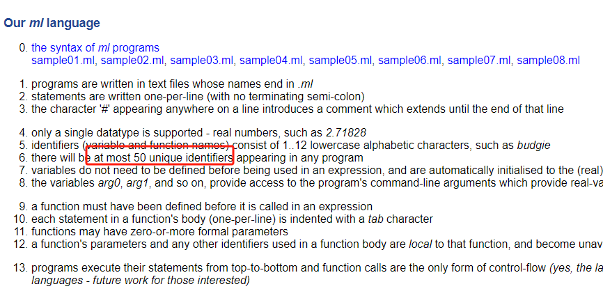
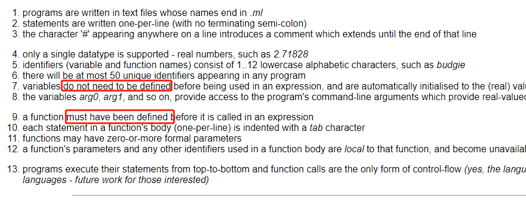
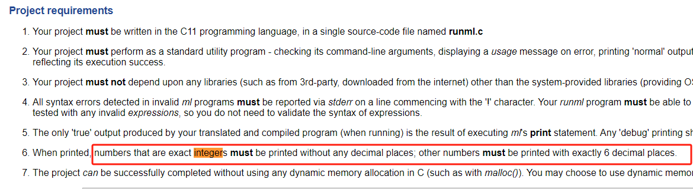

# Questions

1. Does the conditon 50 max unique identifier restriction is your ml program guaranteed, or `runml.c` need to check that if there are more 50 unique identifier, then program should report error.
   
2. Can identifier be redefined. functions name, parameters, be redefined / override by global variables with same name. Do reused identifiers should counted in under maximum 50.
3. Varibales don't need to be defined be for use, e.g. print x + y; # print 0. Do variables need to bbe declare before use?
   
4. Which is integer, 5.0 or 5, or they both treated as integer.
   
5. Will the compile output "runml" executable be tested under a directory without the source file "runml.c", because, My program invloves write the utils and Macros in the "runml.c" file.
6. Have embedded function, e.g. define a child function in a parent function body.
7. If one line have multiple errors, just report the first occurred error, or all the errors at that line.
8. argN e.g. arg4 appear in .ml file. but when running withou assign the cmdline arguments that, it that an error? or just initialize arg4 to 0 treated as a variable.
