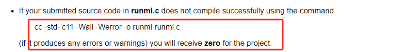

# Questions

1. Does the conditon 50 max unique identifier restriction is your ml program guaranteed, or `runml.c` need to check that if there are more 50 unique identifier, then program should report error.
   
2. Can identifier be redefined. functions name, parameters, be redefined / override by global variables with same name. Do reused identifiers should counted in under maximum 50.

```ml
function f
    return 0

f <- 1 # override function f definition
```

3. Varibales don't need to be defined be for use, e.g. print x + y; # print 0. Do variables need to bbe declare before use?
   

which one is correct syntax

```ml
x # delcared, but no initalized
print x # x initialized to 0
```

```ml
print x + y * z # Not need to be declared, automatically initialized to zero.
```

4. Which is integer, 5.0 or 5, or they both treated as integer.
   

```ml
print 5.0 # should it print just 5, or 5.000000
```

5. Will the compile output "runml" executable be tested under a directory without the source file "runml.c", because, My program invloves write the utils and Macros in the "runml.c" file.
6. Have embedded function, e.g. define a child function in a parent function body.

```ml
function a x y
    function b z
        return z + 1
    return b() + x - y
```

7. If one line have multiple errors, just report the first occurred error, or all the errors at that line.

```ml
print return x2() # has three errors, 1.return, 2. x2 not valid name, 3. x2 is a function not defined.

# report just first one, or all the errors.
```

8. argN e.g. arg4 appear in .ml file. but when running withou assign the cmdline arguments that, it that an error? or just initialize arg4 to 0 treated as a variable.

```ml
print arg4 + arg5 # should initialized arg4 and arg5 to 0, or treated them as errors, because arguments not provided enough

### runml ./program.ml 1.0 2 3.0
```

9. using gcc to error check or self-written error checking logic. But if using gcc to check errors, will get zero marks
   

10. If erros occured in `.ml` file, just don't execute all the statemetns, or execute statements that before erros

```ml
print 1 # no error, should be execute?
print 2 # no error, should be execute?

print x() / 0 # errors
```